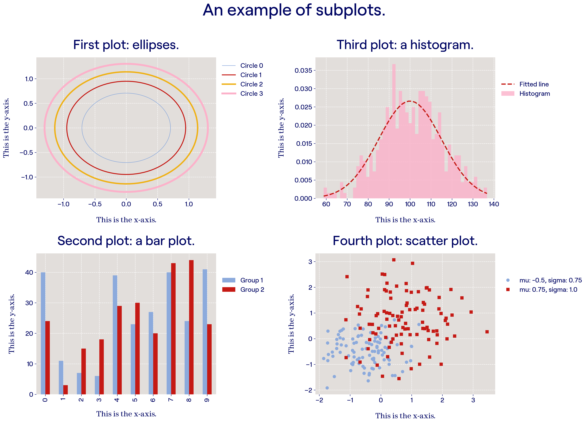

# Data visualisation with Matplotlib in Bit style

Clone this repo and follow the Jupyter Notebook (`Bit_visualisation_matplotlib.ipynb`) for all steps for setting up the Bit style in Matplotlib and on how to make some example plots.

The style sheets can be found in the `Stylesheets` folder. There is a light theme and a dark theme. Put these files in your `.matplotlib/stylelib/` and activate them with the following code:

```
import matplotlib.pyplot as plt
plt.style.use('bit_light') # or change to bit_dark
```

<table><tr><td>Light theme</br></td><td>Dark</br></td></tr></table>

## Fonts
Also make sure you have the fonts installed which can be found [here](https://drive.google.com/drive/u/1/folders/1xzeIhI2yAhqHaqm4qpDM6jxE5PXsdpRv).
